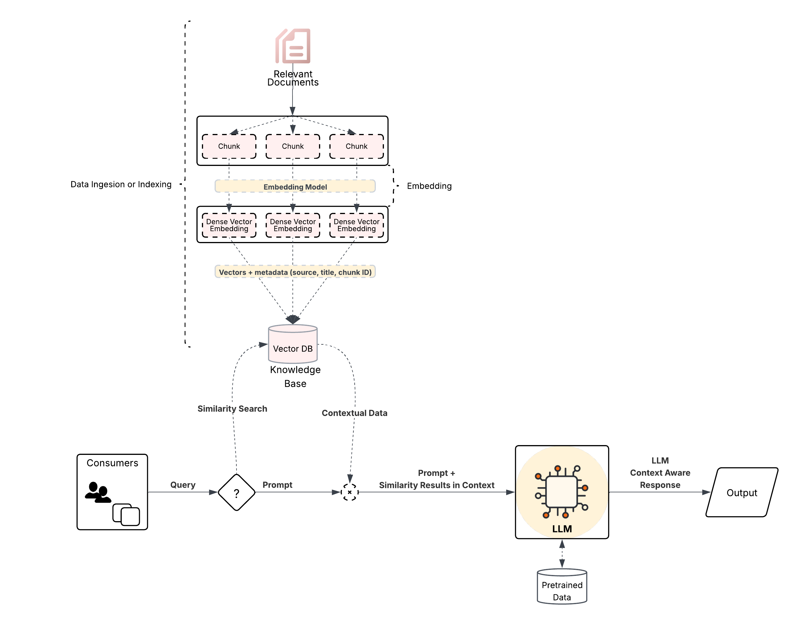

LLM, RAG, Agentic RAG Example
=============================

Purpose
-------
This repository contains `agentic-rag`, a Spring Boot application that demonstrates an integration between Spring AI (OpenAI model bindings) and a vector store (Chroma).

Explanation - Query Options
---------------------------
Query with LLM:-
----------------


Query with RAG:-
---------------


Query with Agentic RAG:-
------------------------


Prerequisites
-------------
- JDK 21
- Maven 3.8+ (or the bundled Maven wrapper `mvnw` / `mvnw.cmd`)
- Network access to your OpenAI-compatible endpoint and Chroma (vector store)

Run
-------
```
mvn clean spring-boot:run
```

Recommended environment variables (example)
-------------------------------------------
- OPENAI_KEY — API key for your OpenAI-compatible provider
- CHROMADB_API_KEY — API key (if your Chroma deployment requires it)
- CHROMADB_DEFAULT_DATABASE — database name used by the Chroma client
- CHROMADB_TENANT_NAME — tenant name used by the Chroma client

Troubleshooting checklist (Chroma I/O error example)
---------------------------------------------------
------------------------------------------
If you see an I/O error similar to:

I/O error on GET request for "http://localhost:8000/api/v2/tenants/default_tenant/databases/default_database/collections/"

Do the following in order:
1. Confirm your effective configuration: `spring.ai.vectorstore.chroma.client.host` and `port` in `application.yaml` or runtime env vars.
2. If those values are unset, set them or supply the environment variables listed above.
3. Ensure the Chroma service is reachable from the host running the app (firewall, VPN, Docker network). Use `curl` or `Invoke-WebRequest` for a quick check.
4. If using a cloud/managed provider, confirm the API key and endpoint are correct and not expired.
5. Review application logs: the Chroma client will log connection attempts and stack traces when failing.

Next steps / Enhancements
------------------------
- Add automated integration tests that spin up a test Chroma instance (or mock the vector-store) to prevent regressions.
- Add a clear `docker-compose` for local development that can bring up a vector-store + app for dev teams.


