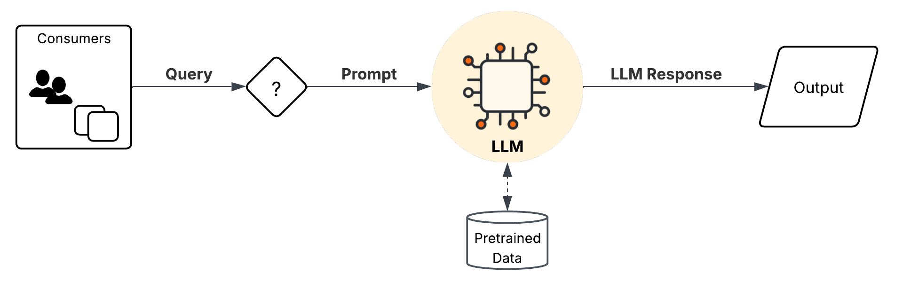
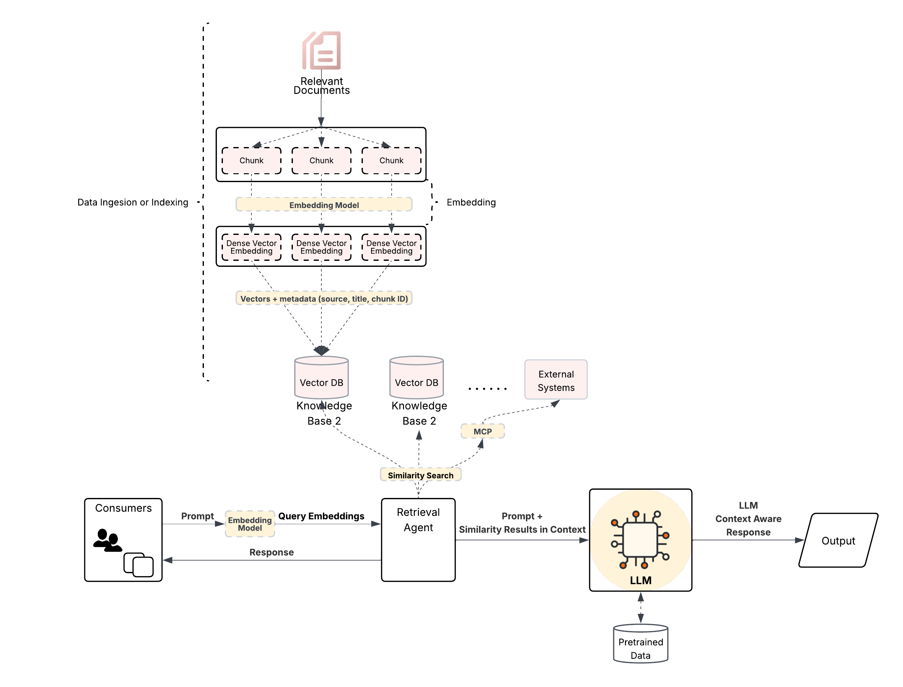
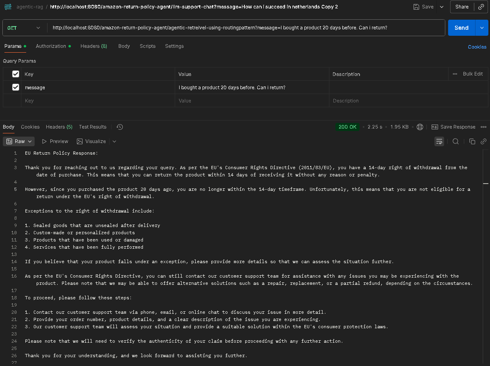
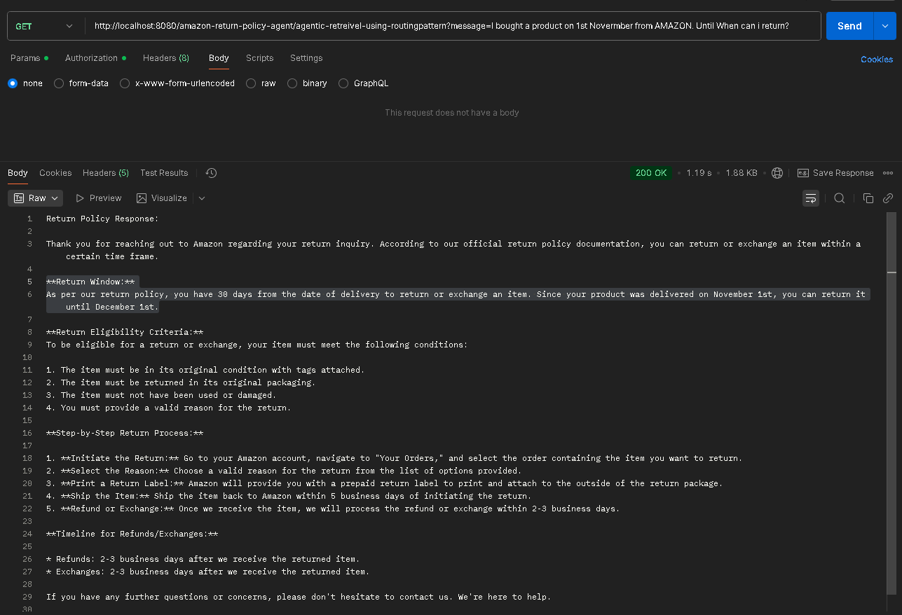
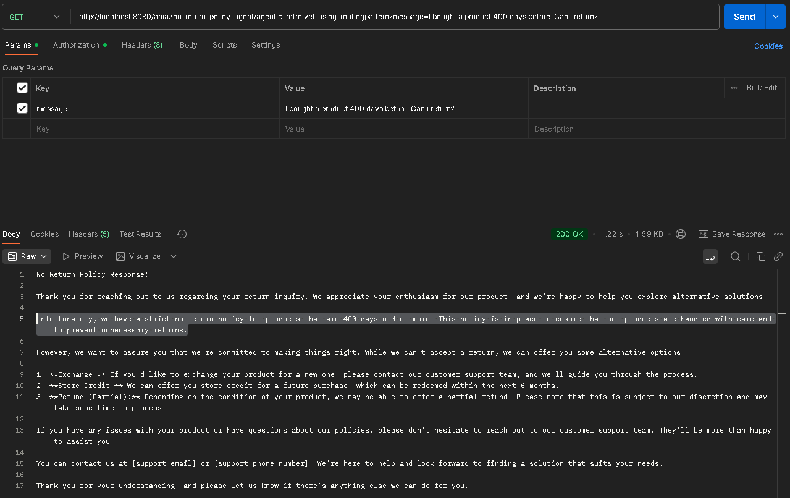
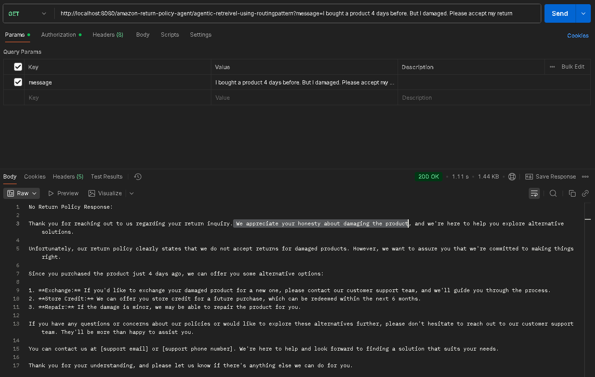
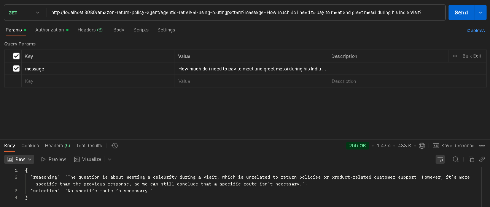
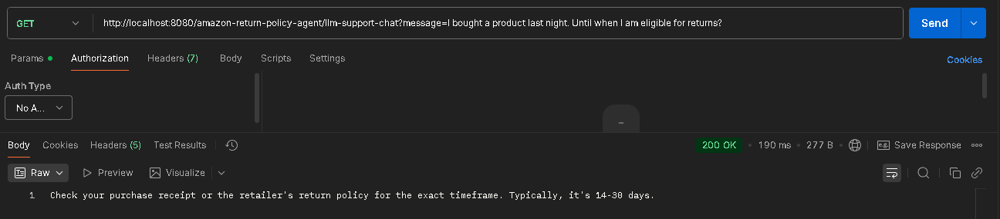

LLM, RAG, Agentic RAG Example
=============================

Purpose
-------
This repository contains `agentic-rag`, a Java Spring Boot based approach to demonstrate an integration between Spring AI (OpenAI model bindings) and a vector store (Chroma).

Explanation - Query Options
---------------------------
Query with LLM:-
----------------


Query with RAG:-
---------------


Query with Agentic RAG:-
------------------------


Prerequisites
-------------
- JDK 21
- Maven 3.8+ (or the bundled Maven wrapper `mvnw` / `mvnw.cmd`)
- Network access to your OpenAI-compatible endpoint and Chroma (vector store)

Run
-------
```
mvn clean spring-boot:run
```

Recommended environment variables (example)
-------------------------------------------
- OPENAI_KEY — API key for your OpenAI-compatible provider. This project is tested with GROQ AI (Note: No embedding model with GROQ yet)
- CHROMADB_API_KEY — API key (if your Chroma deployment requires it)
- CHROMADB_DEFAULT_DATABASE — database name used by the Chroma client
- CHROMADB_TENANT_NAME — tenant name used by the Chroma client

Troubleshooting checklist (Chroma I/O error example)
---------------------------------------------------
------------------------------------------
If you see an I/O error similar to:

I/O error on GET request for "http://localhost:8000/api/v2/tenants/default_tenant/databases/default_database/collections/"

Do the following in order:
1. Confirm your effective configuration: `spring.ai.vectorstore.chroma.client.host` and `port` in `application.yaml` or runtime env vars.
2. If those values are unset, set them or supply the environment variables listed above.
3. Ensure the Chroma service is reachable from the host running the app (firewall, VPN, Docker network). Use `curl` or `Invoke-WebRequest` for a quick check.
4. If using a cloud/managed provider, confirm the API key and endpoint are correct and not expired.
5. Review application logs: the Chroma client will log connection attempts and stack traces when failing.
6. As there is a Bug in Chroma which causes Permission denied error, until it is merged, we can only use 1.1.0-SNAPSHOT for spring-ai-starter-vector-store-chroma. It is available only in Spring Snapshots repo. 
We identified and it is fixed by Chroma team. https://github.com/spring-projects/spring-ai/pull/4571

```
   {
   "error": "ChromaError",
   "message": "Permission denied."
   }
```

Tests
==========================

Agentic Non RAG LLM Call:-
-------------------------
_Selected route: eu-return-policy-agent_
```
API Call:-
http://localhost:8080/amazon-return-policy-agent/agentic-retrieval-using-routingpattern?message=I bought a product 20 days before. Can i return?

Logs:- 
2025-11-06T21:32:47.986+01:00  INFO 10124 --- [agentic-ai] [nio-8080-exec-2] i.j.a.r.agentic.RoutingRetrievalAgent    : Routing Analysis: The customer inquired about returning a product 20 days after purchase, which falls under the EU's 14-day right of withdrawal. The mention of the purchase date and the specific timeframe suggests that the customer is seeking guidance on their EU consumer rights.. 
Selected route: eu-return-policy-agent
```


Agentic RAG LLM Call:-
----------------------
_Selected route: amazon-return-policy-agent_
```
API Call:- 
http://localhost:8080/amazon-return-policy-agent/agentic-retrieval-using-routingpattern?message=I bought a product 20 days before. Can i return?

Logs:-
2025-11-06T21:39:04.889+01:00  INFO 10124 --- [agentic-ai] [nio-8080-exec-5] i.j.a.r.agentic.RoutingRetrievalAgent    : Routing Analysis: The customer purchased the product on Amazon and is inquiring about the return window. Given that Amazon's return policy is more specific to their platform, it is best to refer to their official return policy documentation for the most accurate and up-to-date information.. 
Selected route: amazon-return-policy-agent
```



Agentic RAG LLM Call Final Route:-
----------------------------------
_Selected route: no-return-policy-agent_

```
API Call:- http://localhost:8080/amazon-return-policy-agent/agentic-retrieval-using-routingpattern?message=I bought a product 400 days before. Can i return?

Logs:-
2025-11-06T21:43:34.228+01:00  INFO 10124 --- [agentic-ai] [nio-8080-exec-8] i.j.a.r.agentic.RoutingRetrievalAgent    : Routing Analysis: The customer purchased the product 400 days before, which far exceeds the typical return window of 14-30 days. Given the prolonged timeframe, it is likely that the customer is no longer eligible for a return under Amazon's return policy or EU consumer rights. The most suitable course of action would be to inform the customer that their return is not eligible and provide alternative solutions such as store credit or exchanges.. 
Selected route: no-return-policy-agent
```


```
API Call:- 
http://localhost:8080/amazon-return-policy-agent/agentic-retrieval-using-routingpattern?message=I bought a product 4 days before. But I damaged. Please accept my return

Logs:-
2025-11-06T21:46:14.986+01:00  INFO 10124 --- [agentic-ai] [nio-8080-exec-1] i.j.a.r.agentic.RoutingRetrievalAgent    : Routing Analysis: The customer purchased the product 4 days before but wants to return it due to damage. The customer's intent is to return the product, but they are outside the 14-day right of withdrawal period, and they are not eligible for a return under Amazon's return policy or EU consumer rights. However, the product is still within the return window, and the customer is requesting a return. The most suitable course of action would be to inform the customer about the return process and the alternatives available to them.. 
Selected route: no-return-policy-agent
```


```
API Call:- 
http://localhost:8080/amazon-return-policy-agent/agentic-retrieval-using-routingpattern?message=How much do i need to pay to meet and greet messi during his India visit?

Logs:-
2025-11-07T09:50:58.104+01:00  INFO 5008 --- [agentic-ai] [nio-8080-exec-2] i.j.a.r.agentic.RoutingRetrievalAgent    : Routing Analysis: The question is not related to return policies, products, or customer support for existing purchases. It appears to be a general inquiry about meeting a celebrity during a visit.. Selected route: No specific route is necessary.
```


Generic LLM Call:-
---------------
_No agent Mode. Just simple LLM Call_

```
http://localhost:8080/amazon-return-policy-agent/llm-support-chat?message=I bought a product last night. Until when I am eligible for returns?
```


_No agent Mode. Just simple LLM Call for testing recent data beyond LLM cutoff date_

```
http://localhost:8080/amazon-return-policy-agent/llm-support-chat?message=Can share the latest amazon return policy from yesterday?
```


Semantic search :-
------------------
_No agent Mode. Just simple RAG semantic search_
```
API Call:-
http://localhost:8080/amazon-return-policy-agent/rag-query-documents?message=show me the premium condition

Response:-
{'ids': [['f72cba9c-c7f1-4ea3-802b-f653a0477dc9', 'c132d4cb-bab1-40a5-a4ab-5d1f39f189b0', '9fd7aae8-e1e4-4c27-90f8-2ea85aaba0e8', '9bc922a2-79b2-4450-9991-ed0c06d5c80f']], 'distances': [[0.7256948, 1.2676034, 1.2866392, 1.3056235]], 'embeddings': None, 'metadatas': [[{'line': 34}, {'line': 27}, {'line': 24}, {'line': 105}]], 'documents': [['Amazon Renewed products in "Premium" condition', 'Amazon Renewed products in "Acceptable", "Good", or "Excellent" condition types.', 'Apple Brand products and Boost Infinite Brand products sold in new condition (AppleCare+ plans may be canceled in accordance with the terms of the plan)', 'Product Warranties']], 'uris': None, 'data': None, 'included': ['metadatas', 'documents', 'distances']}
```


Test Chroma API Call :-
------------------------
```
https://api.trychroma.com/api/v2/tenants/fbc73a42-df81-4379-9cd5-90f3aa3d5db5/databases/default_database/collections/amazon_return_policy

{
"id": "8ee1da2c-d542-4cbd-8fbb-18c9db16bf68",
"name": "amazon_return_policy",
"configuration_json": {
"hnsw": null,
"spann": {
"search_nprobe": 64,
"write_nprobe": 32,
"space": "l2",
"ef_construction": 200,
"ef_search": 200,
"max_neighbors": 64,
"reassign_neighbor_count": 64,
"split_threshold": 50,
"merge_threshold": 25
},
"embedding_function": {
"type": "known",
"name": "default",
"config": {}
}
},
"schema": {
"defaults": {
"string": {
"fts_index": {
"enabled": false,
"config": {}
},
"string_inverted_index": {
"enabled": true,
"config": {}
}
},
"float_list": {
"vector_index": {
"enabled": false,
"config": {
"space": "l2",
"embedding_function": {
"type": "known",
"name": "default",
"config": {}
},
"source_key": "#document",
"spann": {
"search_nprobe": 64,
"search_rng_factor": 1.0,
"search_rng_epsilon": 10.0,
"nreplica_count": 8,
"write_rng_factor": 1.0,
"write_rng_epsilon": 5.0,
"split_threshold": 50,
"num_samples_kmeans": 1000,
"initial_lambda": 100.0,
"reassign_neighbor_count": 64,
"merge_threshold": 25,
"num_centers_to_merge_to": 8,
"write_nprobe": 32,
"ef_construction": 200,
"ef_search": 200,
"max_neighbors": 64
}
}
}
},
"sparse_vector": {
"sparse_vector_index": {
"enabled": false,
"config": {
"embedding_function": {
"type": "unknown"
},
"bm25": false
}
}
},
"int": {
"int_inverted_index": {
"enabled": true,
"config": {}
}
},
"float": {
"float_inverted_index": {
"enabled": true,
"config": {}
}
},
"bool": {
"bool_inverted_index": {
"enabled": true,
"config": {}
}
}
},
"keys": {
"#embedding": {
"float_list": {
"vector_index": {
"enabled": true,
"config": {
"space": "l2",
"embedding_function": {
"type": "known",
"name": "default",
"config": {}
},
"source_key": "#document",
"spann": {
"search_nprobe": 64,
"search_rng_factor": 1.0,
"search_rng_epsilon": 10.0,
"nreplica_count": 8,
"write_rng_factor": 1.0,
"write_rng_epsilon": 5.0,
"split_threshold": 50,
"num_samples_kmeans": 1000,
"initial_lambda": 100.0,
"reassign_neighbor_count": 64,
"merge_threshold": 25,
"num_centers_to_merge_to": 8,
"write_nprobe": 32,
"ef_construction": 200,
"ef_search": 200,
"max_neighbors": 64
}
}
}
}
},
"line": {
"int": {
"int_inverted_index": {
"enabled": true,
"config": {}
}
}
},
"#document": {
"string": {
"fts_index": {
"enabled": true,
"config": {}
},
"string_inverted_index": {
"enabled": false,
"config": {}
}
}
}
}
},
"metadata": {
"description": "Amazon Return Policy Document Collection"
},
"dimension": 384,
"tenant": "fbc73a42-df81-4379-9cd5-90f3aa3d5db5",
"database": "default_database",
"log_position": 1071,
"version": 4
}
```